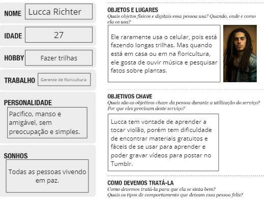
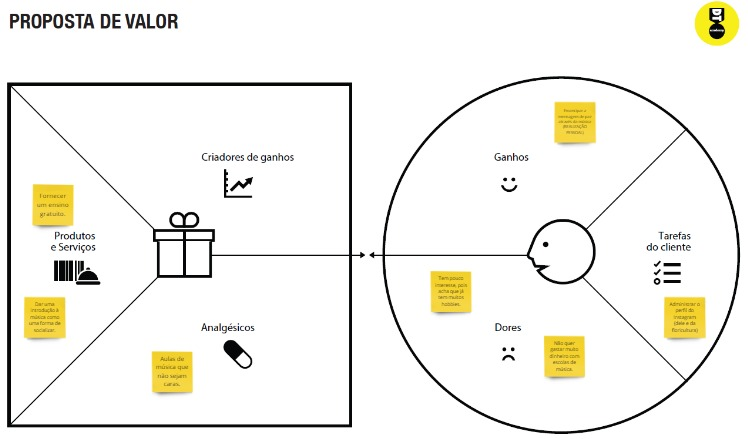
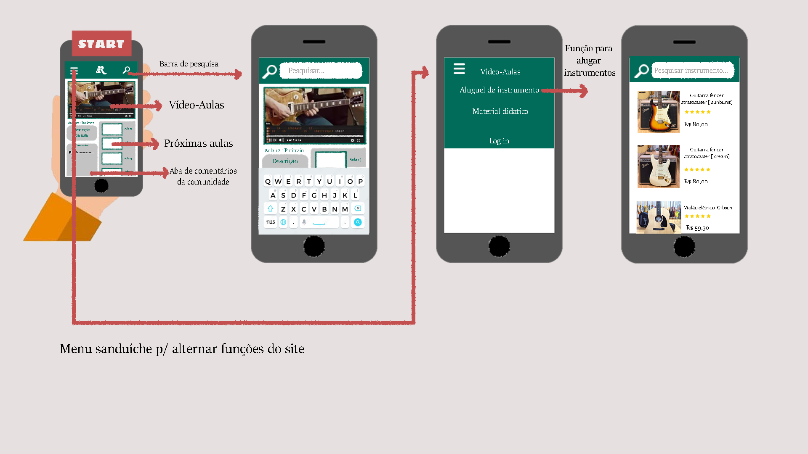
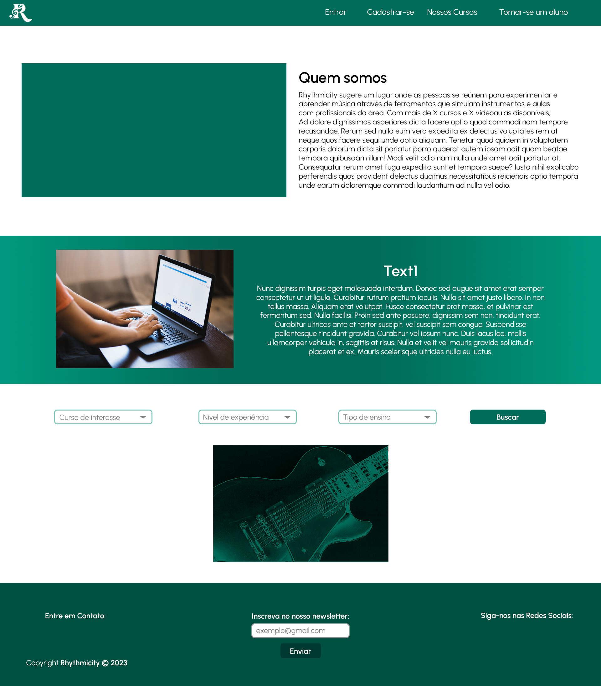

# Informações do Projeto
` Informações do Projeto`  

PROJETO RHYTMICITY

`Curso` 

Ciência da Computação PUC Minas

## Participantes

> - Felipe Vilhena
> - Lucas Hauck
> - Gabriel Apocalypse
> - Luiz Segolin

# Estrutura do Documento

- [Informações do Projeto](#informações-do-projeto)
  - [Participantes](#participantes)
- [Estrutura do Documento](#estrutura-do-documento)
- [Introdução](#introdução)
  - [Problema](#problema)
  - [Objetivos](#objetivos)
  - [Justificativa](#justificativa)
  - [Público-Alvo](#público-alvo)
- [Especificações do Projeto](#especificações-do-projeto)
  - [Personas, Empatia e Proposta de Valor](#personas-empatia-e-proposta-de-valor)
  - [Histórias de Usuários](#histórias-de-usuários)
  - [Requisitos](#requisitos)
    - [Requisitos Funcionais](#requisitos-funcionais)
    - [Requisitos não Funcionais](#requisitos-não-funcionais)
  - [Restrições](#restrições)
- [Projeto de Interface](#projeto-de-interface)
  - [User Flow](#user-flow)
  - [Wireframes](#wireframes)
- [Metodologia](#metodologia)
  - [Divisão de Papéis](#divisão-de-papéis)
  - [Ferramentas](#ferramentas)
  - [Controle de Versão](#controle-de-versão)
- [**############## SPRINT 1 ACABA AQUI #############**](#-sprint-1-acaba-aqui-)
- [Projeto da Solução](#projeto-da-solução)
  - [Tecnologias Utilizadas](#tecnologias-utilizadas)
  - [Arquitetura da solução](#arquitetura-da-solução)
- [Avaliação da Aplicação](#avaliação-da-aplicação)
  - [Plano de Testes](#plano-de-testes)
  - [Ferramentas de Testes (Opcional)](#ferramentas-de-testes-opcional)
  - [Registros de Testes](#registros-de-testes)
- [Referências](#referências)

# Introdução

## Problema

 - Atualmente, muitas pessoas encontram dificuldades em aprender música. Uma das principais razões é a falta de tempo. Com a vida agitada e a sobrecarga de compromissos, muitas pessoas têm dificuldade em encaixar aulas de música em sua rotina. Além disso, o preço dos instrumentos pode ser bastante alto, o que pode desencorajar as pessoas a se envolverem com a música. Por fim, o mundo atual, que é cada vez mais rápido e cheio de distrações, pode reduzir a motivação das pessoas para aprender música, pois elas podem sentir que não têm tempo ou energia para se dedicar a algo que exige tempo e esforço.

## Objetivos

 - O projeto RHYTHMICITY tem como principais objetivos oferecer uma plataforma e comunidade de ensino de música mais atrativa e rápida, além de disponibilizar aluguéis de instrumentos musicais. Com o intuito de proporcionar uma experiência mais interativa e personalizada aos usuários, a plataforma conta com diversas funcionalidades que permitem o aprendizado de forma dinâmica e divertida. Além disso, a disponibilidade de aluguéis de instrumentos oferece uma solução prática e acessível para quem deseja aprender a tocar um instrumento sem precisar investir em um equipamento logo no início. 

## Justificativa

 - Primeiramente, a plataforma busca oferecer uma experiência mais atrativa e rápida para o ensino de música. Muitas vezes, o aprendizado de música pode ser desmotivador para os alunos, especialmente quando se utiliza métodos tradicionais de ensino, que podem ser monótonos e pouco interativos. Com a utilização de tecnologias e funcionalidades dinâmicas, o RHYTHMICITY busca tornar o aprendizado de música mais envolvente e divertido, o que pode aumentar a motivação dos alunos e, consequentemente, melhorar seu desempenho e retenção de conhecimento.

Além disso, a disponibilidade de aluguéis de instrumentos musicais é uma solução prática e acessível para aqueles que desejam aprender a tocar um instrumento, mas não têm condições financeiras para adquirir um equipamento logo no início. Isso pode ajudar a democratizar o acesso ao ensino de música, permitindo que pessoas de diferentes níveis socioeconômicos possam ter a oportunidade de aprender um novo hobby ou até mesmo desenvolver uma carreira profissional na área.

Em resumo, o projeto RHYTHMICITY busca solucionar problemas relacionados à motivação e acessibilidade no ensino de música, através de uma plataforma interativa e personalizada, além de oferecer aluguéis de instrumentos musicais como uma solução prática e acessível para aqueles que desejam iniciar seus estudos.

## Público-Alvo

- O público-alvo do RHYTHMICITY são pessoas que têm interesse em praticar e aprender música, mas que por diversos motivos, como rotina corrida, falta de motivação ou falta de acessibilidade em escolas e cursos de música, acabaram perdendo o contato com essa atividade. A plataforma busca atrair essas pessoas oferecendo uma experiência mais dinâmica e personalizada de ensino, que pode ajudá-las a recuperar o interesse pela música e retomar seus estudos. Além disso, a disponibilidade de aluguéis de instrumentos musicais torna o acesso ao aprendizado mais acessível, permitindo que pessoas de diferentes níveis socioeconômicos possam ter a oportunidade de aprender e praticar música.
 
# Especificações do Projeto

- O Projeto RHYTHMICITY será desenvolvido como um site, utilizando linguagens como HTML, CSS e Bootstrap para criar uma plataforma e comunidade de estudo de música. A utilização dessas tecnologias permite criar uma plataforma dinâmica e responsiva, que se adapta a diferentes dispositivos e tamanhos de tela. Além disso, a parte de design e artística será desenvolvida principalmente no software Adobe Photoshop CC, permitindo a criação de imagens e elementos gráficos personalizados que podem ser integrados à plataforma. A utilização de técnicas de design visual e artístico pode ajudar a tornar a plataforma mais atraente e agradável visualmente para os usuários, o que pode aumentar sua motivação e engajamento no aprendizado de música.

## Personas, Empatia e Proposta de Valor
 
> **Exemplo de Persona**
> 
> 
> 

> **Exemplo de Proposta de Valor**
> 

## Histórias de Usuários

Com base na análise das personas forma identificadas as seguintes histórias de usuários:

|EU COMO... `PERSONA`| QUERO/PRECISO `APRENDER MAIS RAPIDO`   |PARA ... `NAO TOMAR MUITO TEMPO E MESMO ASSIM APRENDER`                                     |
|--------------------|---------------------------------------|---------------------------------------------------------------------------------------------|
|Usuário do sistema  | Video-Aulas dinamicas                 | Permitir que pare as aulas em qualquer tempo e retomar depois onde parou                    |
|Administrador       | Por video-aulas curtas                | Permitir que possam administrar materiais e video-aulas                                     |

|EU COMO... `PERSONA`| QUERO/PRECISO `ALUGAR UM MATERIAL`    |PARA ... `NAO TER QUE GASTAR MUITO EM UM INSTRUMENTO`                                        |
|--------------------|---------------------------------------|---------------------------------------------------------------------------------------------|
|Usuário do sistema  | Procurar por instrumento              | Escolhe o tipo de instrumento, marca e preço                                                |
|Administrador       | Mostar os instrumentos disponíveis    | Filtrar as melhores opções                                                                  |

## Requisitos

As tabelas que se seguem apresentam os requisitos funcionais e não funcionais que detalham o escopo do projeto.

### Requisitos Funcionais

|ID    | Descrição do Requisito  | Prioridade |
|------|-----------------------------------------|----|
|RF-001| Permitir que o usuário cadastre tarefas | ALTA | 
|RF-002| Emitir um relatório de tarefas no mês   | MÉDIA |

### Requisitos não Funcionais

|ID     | Descrição do Requisito  |Prioridade |
|-------|-------------------------|----|
|RNF-001| O sistema deve ser responsivo para rodar em um dispositivos móvel | MÉDIA | 
|RNF-002| Deve processar requisições do usuário em no máximo 3s |  BAIXA | 

> Com base nas Histórias de Usuário, enumere os requisitos da sua
> solução. Classifique esses requisitos em dois grupos:
>
> - [Requisitos Funcionais (RF)](https://pt.wikipedia.org/wiki/Requisito_funcional):
>   correspondem a uma funcionalidade que deve estar presente na
>   plataforma (ex: cadastro de usuário).
>
> - [Requisitos Não Funcionais (RNF)](https://pt.wikipedia.org/wiki/Requisito_n%C3%A3o_funcional):
>   correspondem a uma característica técnica, seja de usabilidade,
>   desempenho, confiabilidade, segurança ou outro (ex: suporte a
>   dispositivos iOS e Android).
>
> Lembre-se que cada requisito deve corresponder à uma e somente uma
> característica alvo da sua solução. Além disso, certifique-se de que
> todos os aspectos capturados nas Histórias de Usuário foram cobertos.
> 
> **Links Úteis**:
> 
> - [O que são Requisitos Funcionais e Requisitos Não Funcionais?](https://codificar.com.br/requisitos-funcionais-nao-funcionais/)
> - [O que são requisitos funcionais e requisitos não funcionais?](https://analisederequisitos.com.br/requisitos-funcionais-e-requisitos-nao-funcionais-o-que-sao/)

## Restrições

O projeto está restrito pelos itens apresentados na tabela a seguir.

|ID| Restrição                                             |
|--|-------------------------------------------------------|
|01| O projeto deverá ser entregue até o final do semestre |
|02| Não pode ser desenvolvido um módulo de backend        |

> Enumere as restrições à sua solução. Lembre-se de que as restrições
> geralmente limitam a solução candidata.
> 
> **Links Úteis**:
> - [O que são Requisitos Funcionais e Requisitos Não Funcionais?](https://codificar.com.br/requisitos-funcionais-nao-funcionais/)
> - [O que são requisitos funcionais e requisitos não funcionais?](https://analisederequisitos.com.br/requisitos-funcionais-e-requisitos-nao-funcionais-o-que-sao/)

# Projeto de Interface
> - O processo criativo do userflow e da interface do projeto RHYTMICITY foi cuidadosamente planejado para oferecer uma experiência confortável e responsiva aos usuários. A abordagem minimalista e direta ao ponto do design garante que os usuários possam navegar pelo aplicativo de maneira intuitiva, sem distrações desnecessárias. O objetivo é criar uma experiência de uso suave e sem complicações, permitindo que os usuários desfrutem ao máximo do aplicativo e se concentrem na música.

## User Flow

> **Exemplo**:
> 
> 

## Wireframes

> **Exemplo**:
> 
> 

# Metodologia

......  COLOQUE AQUI O SEU TEXTO ......

> Nesta parte do documento, você deve apresentar a metodologia 
> adotada pelo grupo, descrevendo o processo de trabalho baseado nas metodologias ágeis, 
> a divisão de papéis e tarefas, as ferramentas empregadas e como foi realizada a
> gestão de configuração do projeto via GitHub.
>
> Coloque detalhes sobre o processo de Design Thinking e a implementação do Framework Scrum seguido
> pelo grupo. O grupo poderá fazer uso de ferramentas on-line para acompanhar
> o andamento do projeto, a execução das tarefas e o status de desenvolvimento
> da solução.
> 
> **Links Úteis**:
> - [Tutorial Trello](https://trello.com/b/8AygzjUA/tutorial-trello)
> - [Gestão ágil de projetos com o Trello](https://www.youtube.com/watch?v=1o9BOMAKBRE)
> - [Gerência de projetos - Trello com Scrum](https://www.youtube.com/watch?v=DHLA8X_ujwo)
> - [Tutorial Slack](https://slack.com/intl/en-br/)

## Divisão de Papéis

......  COLOQUE AQUI O SEU TEXTO ......

> Apresente a divisão de papéis e tarefas entre os membros do grupo.
>
> **Links Úteis**:
> - [11 Passos Essenciais para Implantar Scrum no seu Projeto](https://mindmaster.com.br/scrum-11-passos/)
> - [Scrum em 9 minutos](https://www.youtube.com/watch?v=XfvQWnRgxG0)

## Ferramentas

......  COLOQUE AQUI O SEU TEXTO - SIGA O EXEMPLO DA TABELA ABAIXO  ......

| Ambiente  | Plataforma              |Link de Acesso |
|-----------|-------------------------|---------------|
|Processo de Design Thinkgin  | Miro |  https://miro.com/XXXXXXX | 
|Repositório de código | GitHub | https://github.com/XXXXXXX | 
|Hospedagem do site | Heroku |  https://XXXXXXX.herokuapp.com | 
|Protótipo Interativo | MavelApp ou Figma | https://figma.com/XXXXXXX | 

>
> Liste as ferramentas empregadas no desenvolvimento do
> projeto, justificando a escolha delas, sempre que possível.
> 
> As ferramentas empregadas no projeto são:
> 
> - Editor de código.
> - Ferramentas de comunicação
> - Ferramentas de diagramação
> - Plataforma de hospedagem
> 
> O editor de código foi escolhido porque ele possui uma integração com o
> sistema de versão. As ferramentas de comunicação utilizadas possuem
> integração semelhante e por isso foram selecionadas. Por fim, para criar
> diagramas utilizamos essa ferramenta por melhor captar as
> necessidades da nossa solução.
> 
> **Links Úteis - Hospedagem**:
> - [Getting Started with Heroku](https://devcenter.heroku.com/start)
> - [Crie seu Site com o HostGator](https://www.hostgator.com.br/como-publicar-seu-site)
> - [GoDady](https://br.godaddy.com/how-to)
> - [GitHub Pages](https://pages.github.com/)

## Controle de Versão

......  COLOQUE AQUI O SEU TEXTO ......

> Discuta como a configuração do projeto foi feita na ferramenta de
> versionamento escolhida. Exponha como a gerência de tags, merges,
> commits e branchs é realizada. Discuta como a gerência de issues foi
> realizada.
> A ferramenta de controle de versão adotada no projeto foi o
> [Git](https://git-scm.com/), sendo que o [Github](https://github.com)
> foi utilizado para hospedagem do repositório `upstream`.
> 
> O projeto segue a seguinte convenção para o nome de branchs:
> 
> - `master`: versão estável já testada do software
> - `unstable`: versão já testada do software, porém instável
> - `testing`: versão em testes do software
> - `dev`: versão de desenvolvimento do software
> 
> Quanto à gerência de issues, o projeto adota a seguinte convenção para
> etiquetas:
> 
> - `bugfix`: uma funcionalidade encontra-se com problemas
> - `enhancement`: uma funcionalidade precisa ser melhorada
> - `feature`: uma nova funcionalidade precisa ser introduzida
>
> **Links Úteis**:
> - [Tutorial GitHub](https://guides.github.com/activities/hello-world/)
> - [Git e Github](https://www.youtube.com/playlist?list=PLHz_AreHm4dm7ZULPAmadvNhH6vk9oNZA)
> - [5 Git Workflows & Branching Strategy to deliver better code](https://zepel.io/blog/5-git-workflows-to-improve-development/)
>
> **Exemplo - GitHub Feature Branch Workflow**:
>
> 

# **############## SPRINT 1 ACABA AQUI #############**

# Projeto da Solução

......  COLOQUE AQUI O SEU TEXTO ......

## Tecnologias Utilizadas

......  COLOQUE AQUI O SEU TEXTO ......

> Descreva aqui qual(is) tecnologias você vai usar para resolver o seu
> problema, ou seja, implementar a sua solução. Liste todas as
> tecnologias envolvidas, linguagens a serem utilizadas, serviços web,
> frameworks, bibliotecas, IDEs de desenvolvimento, e ferramentas.
> Apresente também uma figura explicando como as tecnologias estão
> relacionadas ou como uma interação do usuário com o sistema vai ser
> conduzida, por onde ela passa até retornar uma resposta ao usuário.
> 
> Inclua os diagramas de User Flow, esboços criados pelo grupo
> (stoyboards), além dos protótipos de telas (wireframes). Descreva cada
> item textualmente comentando e complementando o que está apresentado
> nas imagens.

## Arquitetura da solução

......  COLOQUE AQUI O SEU TEXTO E O DIAGRAMA DE ARQUITETURA .......

> Inclua um diagrama da solução e descreva os módulos e as tecnologias
> que fazem parte da solução. Discorra sobre o diagrama.
> 
> **Exemplo do diagrama de Arquitetura**:
> 
> 

# Avaliação da Aplicação

......  COLOQUE AQUI O SEU TEXTO ......

> Apresente os cenários de testes utilizados na realização dos testes da
> sua aplicação. Escolha cenários de testes que demonstrem os requisitos
> sendo satisfeitos.

## Plano de Testes

......  COLOQUE AQUI O SEU TEXTO ......

> Enumere quais cenários de testes foram selecionados para teste. Neste
> tópico o grupo deve detalhar quais funcionalidades avaliadas, o grupo
> de usuários que foi escolhido para participar do teste e as
> ferramentas utilizadas.
> 
> **Links Úteis**:
> - [IBM - Criação e Geração de Planos de Teste](https://www.ibm.com/developerworks/br/local/rational/criacao_geracao_planos_testes_software/index.html)
> - [Práticas e Técnicas de Testes Ágeis](http://assiste.serpro.gov.br/serproagil/Apresenta/slides.pdf)
> -  [Teste de Software: Conceitos e tipos de testes](https://blog.onedaytesting.com.br/teste-de-software/)

## Ferramentas de Testes (Opcional)

......  COLOQUE AQUI O SEU TEXTO ......

> Comente sobre as ferramentas de testes utilizadas.
> 
> **Links Úteis**:
> - [Ferramentas de Test para Java Script](https://geekflare.com/javascript-unit-testing/)
> - [UX Tools](https://uxdesign.cc/ux-user-research-and-user-testing-tools-2d339d379dc7)

## Registros de Testes

......  COLOQUE AQUI O SEU TEXTO ......

> Discorra sobre os resultados do teste. Ressaltando pontos fortes e
> fracos identificados na solução. Comente como o grupo pretende atacar
> esses pontos nas próximas iterações. Apresente as falhas detectadas e
> as melhorias geradas a partir dos resultados obtidos nos testes.

# Referências

......  COLOQUE AQUI O SEU TEXTO ......

> Inclua todas as referências (livros, artigos, sites, etc) utilizados
> no desenvolvimento do trabalho.
> 
> **Links Úteis**:
> - [Formato ABNT](https://www.normastecnicas.com/abnt/trabalhos-academicos/referencias/)
> - [Referências Bibliográficas da ABNT](https://comunidade.rockcontent.com/referencia-bibliografica-abnt/)
